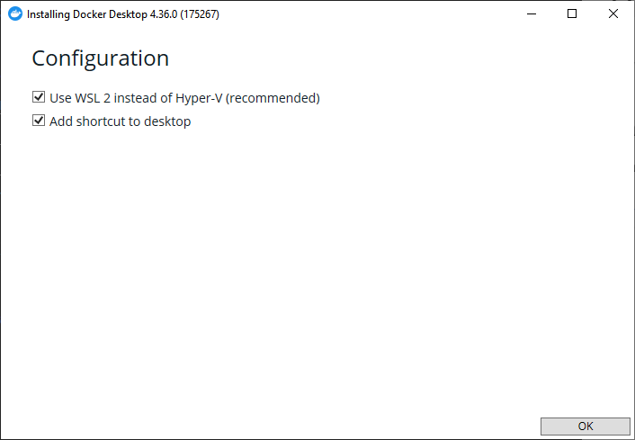
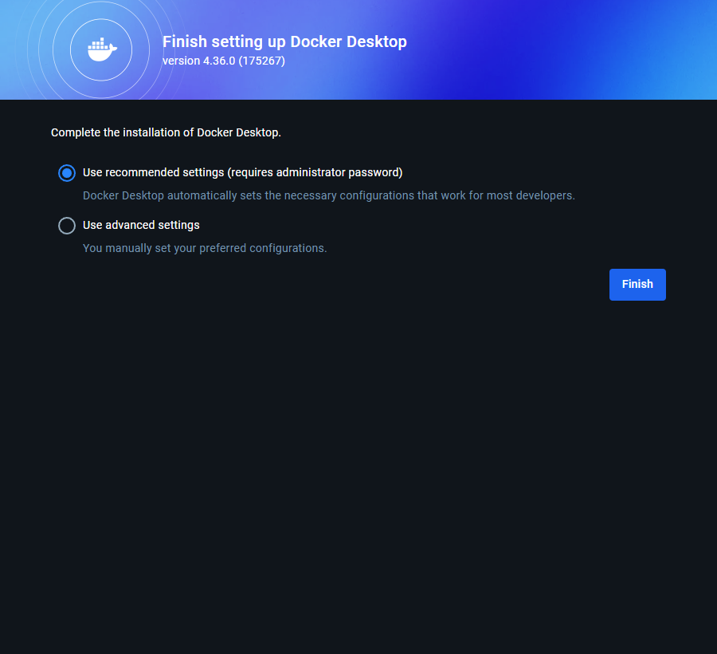

# Установка Git

## Linux

Для установки `git` достаточно ввести в терминале

```sh
sudo apt update && sudo apt install git
```

## Windows

### Загрузка установщика

Скачайте с [сайта](https://git-scm.com/downloads/win) установщик git


### Установка

Установите git. В процессе установки можно оставить все значения по умолчанию.


После этого `git` будет успешно установлен.

## macOS

# Установка Docker

## Linux

### Удаление конфликтующих пакетов

Перед установкой Docker необходимо удалить конфликтующие пакеты, если конечно они были установлены:

```sh
for pkg in docker.io docker-doc docker-compose docker-compose-v2 podman-docker containerd runc; do sudo apt-get remove $pkg; done
```

### Добавление репозитория Docker

Нужно добавить репозитории Docker. Для этого введите в терминале:

```sh
# Add Docker's official GPG key:
sudo apt-get update
sudo apt-get install ca-certificates curl
sudo install -m 0755 -d /etc/apt/keyrings
sudo curl -fsSL https://download.docker.com/linux/ubuntu/gpg -o /etc/apt/keyrings/docker.asc
sudo chmod a+r /etc/apt/keyrings/docker.asc

# Add the repository to Apt sources:
echo \
  "deb [arch=$(dpkg --print-architecture) signed-by=/etc/apt/keyrings/docker.asc] https://download.docker.com/linux/ubuntu \
  $(. /etc/os-release && echo "$VERSION_CODENAME") stable" | \
  sudo tee /etc/apt/sources.list.d/docker.list > /dev/null
sudo apt-get update
```

### Установка

Скачайте по [ссылке](https://desktop.docker.com/linux/main/amd64/docker-desktop-amd64.deb) DEB пакет Docker Desktop, в который входит и Docker Engine, и Docker Desktop.

После скачивания откройте терминал, перейдите в "Загрузки" и установите скачанный пакет:

```sh
cd ~/Downloads
sudo apt update
sudo apt install ./docker-desktop-amd64.deb -y
```

После установки обязательно перезагрузите компьютер.

## Windows

### Загрузка установщика

Скачайте с [официального сайта](https://desktop.docker.com/win/main/amd64/Docker%20Desktop%20Installer.exe?utm_source=docker&utm_medium=webreferral&utm_campaign=dd-smartbutton&utm_location=module) Docker Desktop


Запустите установщик.
Нажмите `OK`.


После установки запустите `Docker`

Выберите пункт `Use recommended settigns`.

Пропустите шаги, если вы не хотите входить в аккаунт Docker Hub


Установка Docker и Docker Desktop на этом завершена.

## macOS
