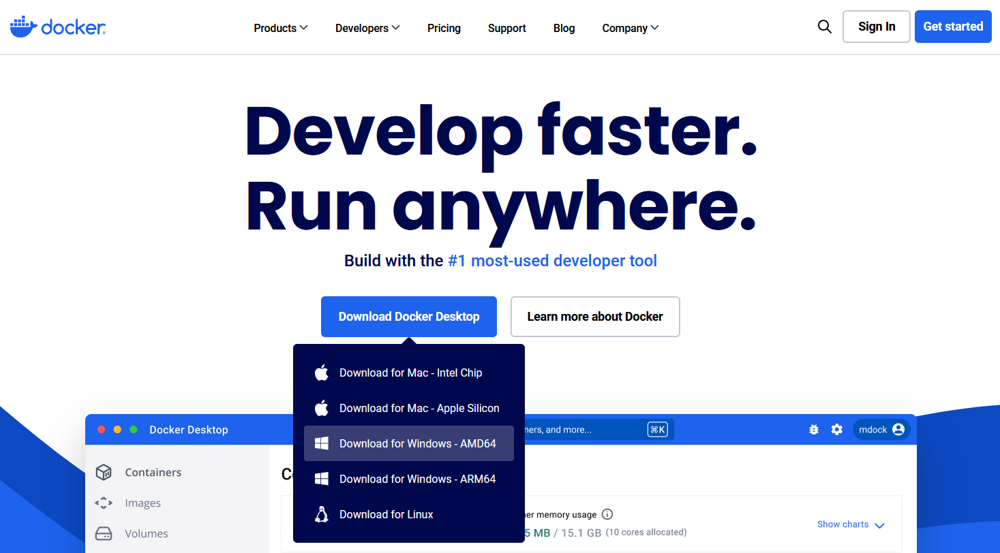
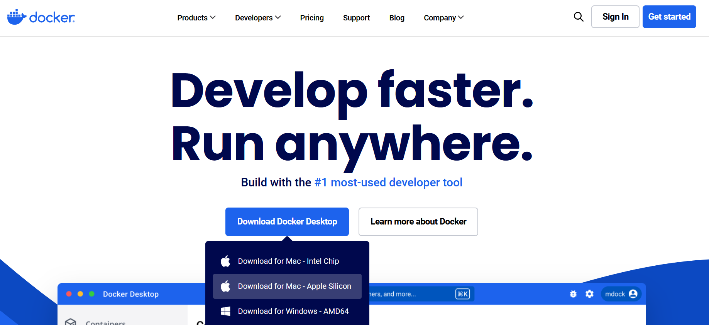
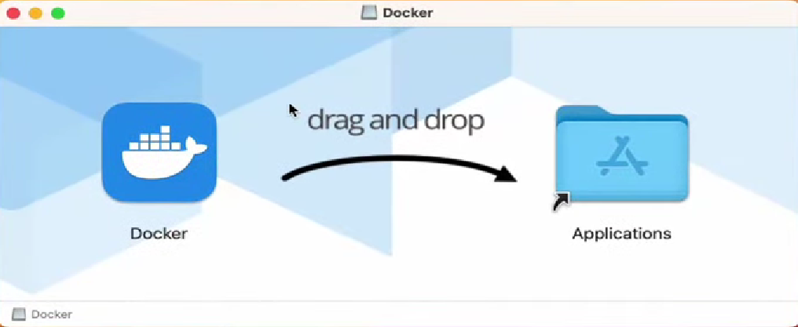

# Установка Git

## Linux

Для установки `git` достаточно ввести в терминале

```sh
sudo apt update && sudo apt install git
```

## Windows

### Загрузка установщика

Скачайте с [сайта][win-git-download-link] установщик git


### Установка

Установите git. В процессе установки можно оставить все значения по умолчанию.


После этого `git` будет успешно установлен.

## macOS

Установка будет проходить через Homebrew. Homebrew — это популярный менеджер пакетов для macOS, который упрощает установку программного обеспечения.

### Установка Homebrew

Установите Homebrew, если он еще не установлен. Введите в терминале:

```sh
/bin/bash -c "$(curl -fsSL https://raw.githubusercontent.com/Homebrew/install/HEAD/install.sh)"
```

### Установка git

После установки Homebrew, введите следующую команду для установки Git:

```sh
brew install git
```

### Проверка версии

После установки проверьте версию Git в терминале:

```sh
git --version
```

# Установка Docker

Мы будем устанавливать не только Docker, но еще и Docker Desktop!
Docker — это платформа контейнеризации с открытым исходным кодом, разработанная для создания, доставки и запуска приложений в контейнерах.
Docker Desktop — это приложение, которое предоставляет графический интерфейс для работы с Docker.

То есть Docker Desktop — это удобный интерфейс для Docker, чтобы нам намного меньше приходилось вводить команды для работы с контейнерами в терминале.

## Linux

### Удаление конфликтующих пакетов

Перед установкой Docker необходимо удалить конфликтующие пакеты, если конечно они были установлены:

```sh
for pkg in docker.io docker-doc docker-compose docker-compose-v2 podman-docker containerd runc; do sudo apt-get remove $pkg; done
```

### Добавление репозитория Docker

Нужно добавить репозиторий Docker в apt. Для этого введите в терминале:

```sh
# Add Docker's official GPG key:
sudo apt-get update
sudo apt-get install ca-certificates curl
sudo install -m 0755 -d /etc/apt/keyrings
sudo curl -fsSL https://download.docker.com/linux/ubuntu/gpg -o /etc/apt/keyrings/docker.asc
sudo chmod a+r /etc/apt/keyrings/docker.asc

# Add the repository to Apt sources:
echo \
  "deb [arch=$(dpkg --print-architecture) signed-by=/etc/apt/keyrings/docker.asc] https://download.docker.com/linux/ubuntu \
  $(. /etc/os-release && echo "$VERSION_CODENAME") stable" | \
  sudo tee /etc/apt/sources.list.d/docker.list > /dev/null
sudo apt-get update
```

### Установка Docker & Docker Desktop

Скачайте по [ссылке][ubuntu-docker-binary] DEB пакет Docker Desktop, в который входит и Docker Engine, и Docker Desktop.

После скачивания откройте терминал, перейдите в "Загрузки" и установите скачанный пакет:

```sh
cd ~/Downloads
sudo apt update
sudo apt install ./docker-desktop-amd64.deb -y
```

После установки обязательно перезагрузите компьютер.

### Проверка работоспобности Docker

Чтобы проверить, работает ли Docker, введите в терминале:

```sh
docker run hello-world
```

На что Docker должен вывести:

```Hello from Docker!
This message shows that your installation appears to be working correctly.

To generate this message, Docker took the following steps:
 1. The Docker client contacted the Docker daemon.
 2. The Docker daemon pulled the "hello-world" image from the Docker Hub.
    (amd64)
 3. The Docker daemon created a new container from that image which runs the
    executable that produces the output you are currently reading.
 4. The Docker daemon streamed that output to the Docker client, which sent it
    to your terminal.

To try something more ambitious, you can run an Ubuntu container with:
 $ docker run -it ubuntu bash

Share images, automate workflows, and more with a free Docker ID:
 https://hub.docker.com/

For more examples and ideas, visit:
 https://docs.docker.com/get-started/
```

### Ошибка Cannot connect to the Docker daemon

Если у вас возникла ошибка `docker: Cannot connect to the Docker daemon at unix:///home/user/.docker/desktop/docker.sock. Is the docker daemon running?`, то введите следующую команду, чтобы пользователь имел права доступа к демону Docker:

```sh
sudo usermod -aG docker $USER
```

## Windows

### Загрузка установщика

Скачайте с [официального сайта][docker-site] Docker Desktop



Запустите установщик.
Нажмите `OK`.


После установки запустите `Docker`

Выберите пункт `Use recommended settigns`.

Пропустите шаги, если вы не хотите входить в аккаунт Docker Hub


### Проверка работоспобности Docker

Чтобы проверить, работает ли Docker, введите в командной строке:

```sh
docker run hello-world
```

На что Docker должен вывести:

```Hello from Docker!
This message shows that your installation appears to be working correctly.

To generate this message, Docker took the following steps:
 1. The Docker client contacted the Docker daemon.
 2. The Docker daemon pulled the "hello-world" image from the Docker Hub.
    (amd64)
 3. The Docker daemon created a new container from that image which runs the
    executable that produces the output you are currently reading.
 4. The Docker daemon streamed that output to the Docker client, which sent it
    to your terminal.

To try something more ambitious, you can run an Ubuntu container with:
 $ docker run -it ubuntu bash

Share images, automate workflows, and more with a free Docker ID:
 https://hub.docker.com/

For more examples and ideas, visit:
 https://docs.docker.com/get-started/
```

Установка Docker и Docker Desktop на этом завершена.

## macOS

### Загрузка установщика

Скачайте с [официального сайта][docker-site] Docker Desktop под вашу платформу


### Установка

Просто перетащите Docker в папку Applications


### Проверка работоспобности Docker

Чтобы проверить, работает ли Docker, введите в терминале:

```sh
docker run hello-world
```

На что Docker должен вывести:

```Hello from Docker!
This message shows that your installation appears to be working correctly.

To generate this message, Docker took the following steps:
 1. The Docker client contacted the Docker daemon.
 2. The Docker daemon pulled the "hello-world" image from the Docker Hub.
    (amd64)
 3. The Docker daemon created a new container from that image which runs the
    executable that produces the output you are currently reading.
 4. The Docker daemon streamed that output to the Docker client, which sent it
    to your terminal.

To try something more ambitious, you can run an Ubuntu container with:
 $ docker run -it ubuntu bash

Share images, automate workflows, and more with a free Docker ID:
 https://hub.docker.com/

For more examples and ideas, visit:
 https://docs.docker.com/get-started/
```

На этом установка Docker завершена!

[win-git-download-link]: https://git-scm.com/downloads/win
[ubuntu-docker-binary]: https://desktop.docker.com/linux/main/amd64/docker-desktop-amd64.deb
[docker-site]: https://www.docker.com/
