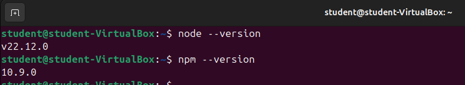
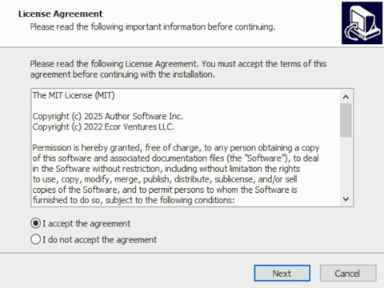

# Установка NodeJS, Python, Docker & Git

## 1. Что такое node, npm и package.json

### Node.js

Наш JavaScript код, который мы писали в предыдущих лабораторных, исполняется в браузере. В браузере у нас есть компилятор JavaScript кода в машинных код, в Google Chrome это движок [V8][v8]. Если мы хотим запускать код на нашем компьютере, а не в браузере, то нам нужно использовать [Node.js][node]. Node - это программная платформа, которая позволяет компилировать JavaScript код в машинный на нашем компьютере. Node.js добавляет возможность нам взаимодействовать с утройствами ввода-вывода, подключать внешние библиотеки. На нем в основном пишут веб-сервера, но есть возможность разрабатывать и десктопные оконные приложения и даже программировать микроконтроллеры.

### Npm

В любом языке программирования нам нужно уметь работать с внешними библиотеками. На фронтенде для этого используется пакетный менеджер [Npm][npm]. С помощью npm мы можем скачивать нужные нам пакеты, которые потом будем использовать в нашем приложении. Все наши библиотеки скачиваются в специальную папку `node_modules`, вы увидите ее у себя в проекте, когда скачаете первую библиотеку.

### Package.json и package-lock.json

[Package.json][package.json] - это основной файл в нашем приложении, который хранит всю информацию о проекте. В этом файле хранится название проекта, описания, версия, скрипты и многое другое. Именно в этом файле храниться информация о всех пакетах, которые мы поставили через npm, и версия этих зависимостей.

[Package-lock.json][package-lock.json] - это файл, который хранит дерево зависимостей. Библиотеки, которые мы устанавливаем, могут иметь вложенные зависимости и этот файл хранит полное дерево.

# Установка Node.js

## Linux

В данном разделе мы будем устанавливать NodeJS на Ubuntu. В системах с другим пакетным менеджером все делается аналогично.

### 1. Обновление дистрибутива

Для начала нужно обновить дистрибутив. Используйте команду:

```sh
sudo apt update && sudo apt upgrade
```


### 2. Установка nvm.

После обновления системы и информации о репозиториях давайте установим nvm. Мы будем использовать для этого встроенную утилиты `wget` или `curl`.

Если у вас в системе установлена **curl**, то введите команду:
`curl -o- https://raw.githubusercontent.com/nvm-sh/nvm/master/install.sh | bash`

Если же у вас не установлена curl, но есть **wget**, то:
`wget -q -O - https://raw.githubusercontent.com/nvm-sh/nvm/master/install.sh | bash`

После установки у вас должно появиться следующее сообщение:

**После этого обязательно перезапустите терминал!** Это необходимо сделать, чтобы команда nvm была доступна.

### 3. Установка NodeJS

И, наконец, установка NodeJS
Выполните команду `nvm install --lts` для установки последней LTS версии NodeJS. LTS версии дольше поддерживаются разработчиками NodeJS чем обычные версии.
\*После установки можно посмотреть список всех установленных версий: `nvm list`, где будет одна только что установленная нами версия (начинается с `->`)


### 4. Давайте проверим версию node и npm:


Как видим, NodeJS и npm успешно установлены.

### 5. Запуск скрипта через Node.js

1. Давайте создадим простой скрипт `hi.js` со следующим содержимым:

```js
console.log("Hello world!");
```

2. Теперь запустим этот скрипт:

```sh
node hi.js
```

Нам должна вывеститься строка `Hello world!` в консоль.

Итого, `Node.js` успешно установлен

## Windows

Мы будем использовать программу nvm-windows для установки NodeJS, потому что версии NodeJS меняются очень быстро и в будущем при работе с различными проектами вам потребуется переключаться между несколькими версиями NodeJS в зависимости от версии, которая требуется для выбранного проекта.
Node version manager, чаще называемый nvm, является самым популярным способом установки нескольких версий Node.js, но доступен только для Mac/Linux и не поддерживается в Windows. Для Windows есть nvm-windows — это инструмент, который позволяет управлять несколькими версиями Node.js на одном компьютере с ОС Windows.

> [!CAUTION]
> Перед установкой диспетчера версий рекомендуется удалить все существующие установки Node.js или npm из операционной системы, так как различные типы установки могут привести к странным и запутанным конфликтам.

### 1. Загрузка установщика

В первую очередь нужно перейти на [страницу релизов nvm-windows][win-nvm-releases]. На ней нужно скачать nvm-setup.exe


### 2. Установка NVM

Установите NVM


### 3. Установка Node

После установки NVM запустите powershell с правами администратора.

Выполните команды:

-   `nvm install latest --lts` для установки последней LTS версии Node
-   `nvm use xx.xx.xx`, где xx.xx.xx -- последняя версия. В моем случае это 23.5.0. Этой командой мы указываем какую версию NodeJS собираемся использовать
-   `npm --version` для проверки работоспособности npm
-   `node --version` для проверки работоспособности node


### 4. Запуск скрипта через Node.js

1. Давайте создадим простой скрипт `hi.js` со следующим содержимым:

```js
console.log("Hello world!");
```

2. Теперь запустим этот скрипт:

```sh
node hi.js
```

Нам должна вывеститься строка `Hello world!` в консоль.

Итого, `Node.js` успешно установлен

## macOS

### 1. Установка Homebrew

Homebrew — это популярный пакетный менеджер для macOS (и Linux), который упрощает установку и управление программным обеспечением. Он позволяет пользователям легко устанавливать, обновлять и удалять программы и библиотеки, используя командную строку.

Установите Homebrew:

```sh
# Download and install Homebrew
curl -o- https://raw.githubusercontent.com/Homebrew/install/HEAD/install.sh | bash
```

### 2. Установка Node.js

Установите Node.js:

```sh
brew install node@22
```

Проверьте, установился ли Node.js и npm:

```sh
node -v # Должна вывести "v22.12.0".

npm -v # Должна вывести "10.9.0".
```

[v8]: https://v8.dev
[node]: https://nodejs.org
[package.json]: https://docs.npmjs.com/cli/v9/configuring-npmpackage-json
[package-lock.json]: https://docs.npmjs.com/cli/v9/configuring-npm/package-lock-json
[npm]: https://www.npmjs.com

### 3. Запуск скрипта через Node.js

1. Давайте создадим простой скрипт `hi.js` со следующим содержимым:

```js
console.log("Hello world!");
```

2. Теперь запустим этот скрипт:

```sh
node hi.js
```

Нам должна вывеститься строка `Hello world!` в консоль.

Итого, `Node.js` успешно установлен

# Инициализация проекта

-   Создаем пустую папку и открываем ее в VS Code.
-   Инициализируем проект в npm с помощью команды `npm init`.

При инициализации проекта у нас будут спрашивать много вопросов, но их все можно пропустить нажав `Enter`. В конце у нас появится настроенный файл `package.json`.

Во все проекты принято добавлять `.gitignore` файл, который не будет добавлять лишнее в наш git репозиторий. Подробнее о `.gitignore` можно почитать [тут][about-gitignore].

-   Создаем файл `.gitignore` и копируем туда содержимое [файла][gitignore-file].

Мы создали проект, который состоит из файлов `package.json` и `.gitignore`. Можно приступать к написанию основного кода.

**_По итогу мы имеем следующую структуру проекта._**

```bash
├── .gitignore
├── package.json
```

[about-gitignore]: https://tyapk.ru/blog/post/gitignore
[gitignore-file]: https://github.com/iu5git/JavaScript/blob/main/tutorials/lab3/assets/.gitignore
[win-nvm-releases]: https://github.com/coreybutler/nvm-windows/releases
