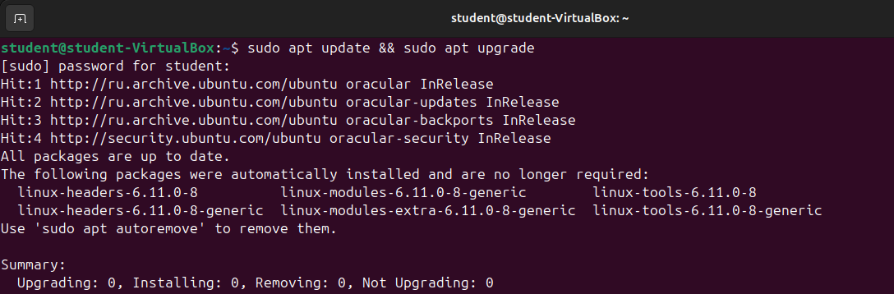
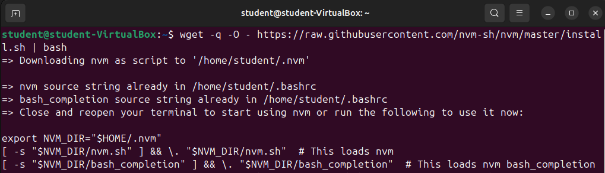
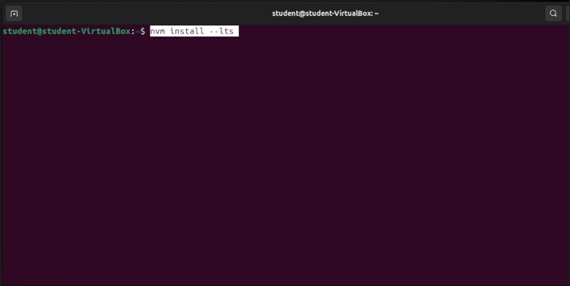
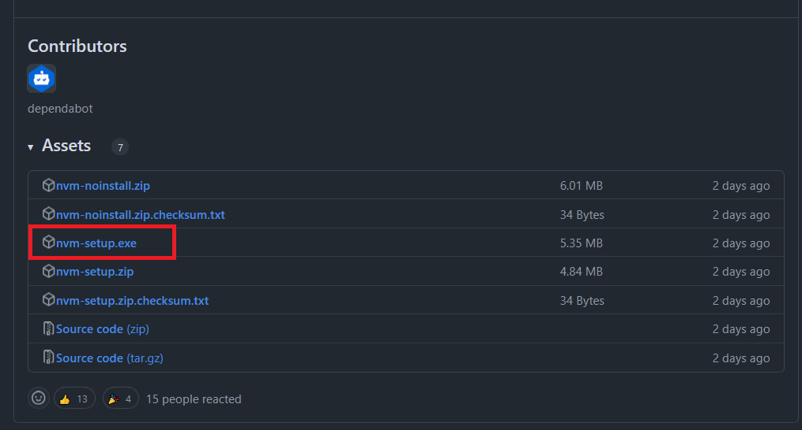
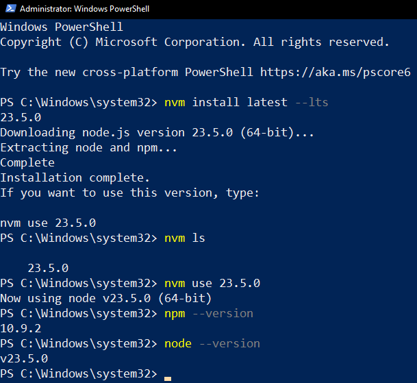

# Установка NodeJS

## 1. Что такое node, npm и package.json

### Node.js

Наш JavaScript код, который мы писали в предыдущих лабораторных, исполняется в браузере. В браузере у нас есть компилятор JavaScript кода в машинных код, в Google Chrome это движок [V8][v8]. Если мы хотим запускать код на нашем компьютере, а не в браузере, то нам нужно использовать [Node.js][node]. Node - это программная платформа, которая позволяет компилировать JavaScript код в машинный на нашем компьютере. Node.js добавляет возможность нам взаимодействовать с утройствами ввода-вывода, подключать внешние библиотеки. На нем в основном пишут веб-сервера, но есть возможность разрабатывать и десктопные оконные приложения и даже программировать микроконтроллеры.

### Установка Node.js

#### Linux (Ubuntu)

В данном разделе мы будем устанавливать NodeJS на Ubuntu. В системах с другим пакетным менеджером все делается аналогично.

1. Для начала нужно обновить дистрибутив.

Используйте команду: `sudo apt update && sudo apt upgrade`.

2. Установка nvm.

После обновления системы и информации о репозиториях давайте установим nvm. Мы будем использовать для этого встроенную утилиты `wget` или `curl`.

Если у вас в системе установлена **curl**, то введите команду:
`curl -o- https://raw.githubusercontent.com/nvm-sh/nvm/master/install.sh | bash`

Если же у вас не установлена curl, но есть **wget**, то:
`wget -q -O - https://raw.githubusercontent.com/nvm-sh/nvm/master/install.sh | bash`

После установки у вас должно появиться следующее сообщение:

**После этого обязательно перезапустите терминал!** Это необходимо сделать, чтобы команда nvm была доступна.

3. Установка NodeJS

И, наконец, установка NodeJS
Выполните команду `nvm install --lts` для установки последней LTS версии NodeJS. LTS версии дольше поддерживаются разработчиками NodeJS чем обычные версии.
\*После установки можно посмотреть список всех установленных версий: `nvm list`, где будет одна только что установленная нами версия (начинается с `->`)

4. Давайте проверим версию node и npm:

Как видим, NodeJS и npm успешно установлены.

#### Windows

Мы будем использовать программу nvm-windows для установки NodeJS, потому что версии NodeJS меняются очень быстро и в будущем при работе с различными проектами вам потребуется переключаться между несколькими версиями NodeJS в зависимости от версии, которая требуется для выбранного проекта.
Node version manager, чаще называемый nvm, является самым популярным способом установки нескольких версий Node.js, но доступен только для Mac/Linux и не поддерживается в Windows. Для Windows есть nvm-windows — это инструмент, который позволяет управлять несколькими версиями Node.js на одном компьютере с ОС Windows.

> [!WARNING]
> Перед установкой диспетчера версий рекомендуется удалить все существующие установки Node.js или npm из операционной системы, так как различные типы установки могут привести к странным и запутанным конфликтам.

1. Загрузка установщика
   В первую очередь нужно перейти на [страницу релизов nvm-windows](https://github.com/coreybutler/nvm-windows/releases). На ней нужно скачать nvm-setup.exe

2. Установка NVM

Установите NVM

3. Установка Node
   После установки NVM запустите powershell с правами администратора.

Выполните команды:

-   `nvm install latest --lts` дял установки последней LTS версии Node
-   `nvm use xx.xx.xx`, где xx.xx.xx -- последняя версия. В моем случае это 23.5.0. Этой командой мы указываем какую версию NodeJS собираемся использовать
-   `npm --version` для проверки работоспособности npm
-   `node --version` для проверки работоспособности node

#### macOS

-   для установки node.js на macOS используйте [Homebrew](https://brew.sh)
-   для установки node.js на Windows используйте [nvm](https://learn.microsoft.com/ru-ru/windows/dev-environment/javascript/nodejs-on-windows)

### Npm

В любом языке программирования нам нужно уметь работать с внешними библиотеками. На фронтенде для этого используется пакетный менеджер [Npm][npm]. С помощью npm мы можем скачивать нужные нам пакеты, которые потом будем использовать в нашем приложении. Все наши библиотеки скачиваются в специальную папку `node_modules`, вы увидите ее у себя в проекте, когда скачаете первую библиотеку.

### Package.json и package-lock.json

[Package.json][package.json] - это основной файл в нашем приложении, который хранит всю информацию о проекте. В этом файле хранится название проекта, описания, версия, скрипты и многое другое. Именно в этом файле храниться информация о всех пакетах, которые мы поставили через npm, и версия этих зависимостей.

[Package-lock.json][package-lock.json] - это файл, который хранит дерево зависимостей. Библиотеки, которые мы устанавливаем, могут иметь вложенные зависимости и этот файл хранит полное дерево.

[v8]: https://v8.dev
[node]: https://nodejs.org
[package.json]: https://docs.npmjs.com/cli/v9/configuring-npmpackage-json
[package-lock.json]: https://docs.npmjs.com/cli/v9/configuring-npm/package-lock-json
[npm]: https://www.npmjs.com
