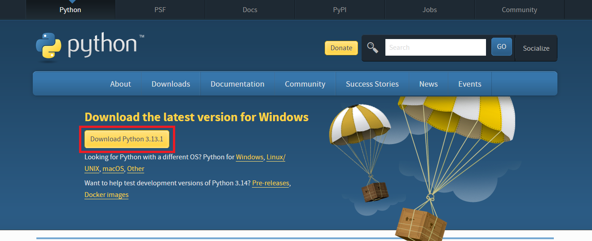
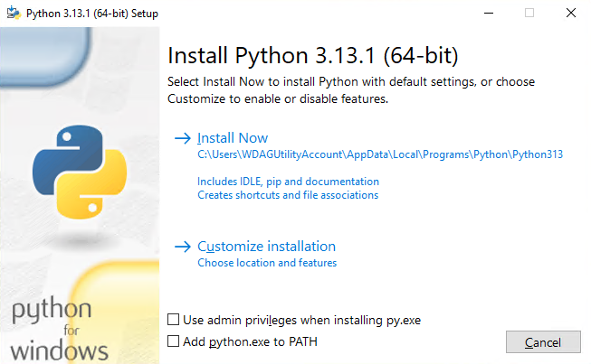
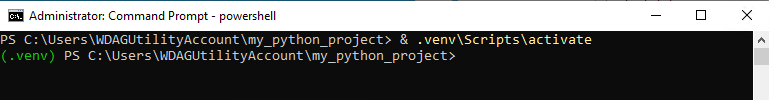
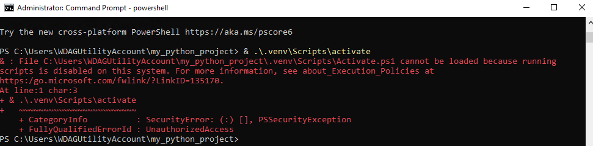

# Linux

# 1. Установка Python

Python является частью многих дистрибутивов Linux, поэтому он предустановлен.
Сначала посмотрите какая версия Python установлена в вашей системе. Для этого выполните команду:

```sh
 python3 --version
```

На момент написания методического указания последней версией Python является 3.12. Она предустановлена в новейших версиях Ubuntu.
Если по каким-либо причинам она не установлена у вас, то введите в терминале:

```sh
sudo apt update && sudo apt install python3.12
```

Теперь при вводе команды `python3` у вас будет запускаться Python 3.12.

# 2. Установка пакетов

Для управления программными пакетами Python используется инструмент pip, предназначенный для установки и управления пакетами программирования.

```sh
sudo apt install -y python3-pip
```

Пакеты Python можно установить с помощью следующей команды:

```sh
pip3 install package_name
```

Для того, чтобы не вводить каждый раз `python3`, а вводить просто `python`, можно установить пакет `python-is-python3`. Он просто создает псевдоним для `python3`.

```sh
sudo apt install python-is-python3
```

# 3. [Виртуальное окружение](https://blog.sedicomm.com/2021/06/29/chto-takoe-venv-i-virtualenv-v-python-i-kak-ih-ispolzovat/#1)

Чтобы создать виртуальную среду, мы используем модуль venv. Это удобный инструмент для управления зависимостями и изоляции проектов, который выстроен в Python, начиная с версии Python 3.3+. Поэтому модуль venv нельзя использовать для изоляции программ Python 2.
Установка venv:

```sh
sudo apt install python3-venv -y
```

## Создание проекта

Приступим к созданию проекта. Первым делом следует создать папку проекта и перейти в нее, в Linux это можно сделать при помощи следующих команд:

```sh
mkdir my_python_project
cd my_python_project
```

## Создание виртуальной среды

Теперь создадим в этой папке виртуальную среду:

```sh
python3 -m venv project_name_myproject
```

## Активация виртуальной среды

Осталось активировать виртуальную среду при помощи команды:

```sh
source project_name_myproject/bin/activate
```

## Проверка установленных пакетов

Теперь проверим установленные пакеты pip внутри виртуальной среды:

```sh
pip3 list
```

## Выход из виртуальной среды

Для выхода из виртуальной среды необходимо выполнить команду:

```sh
deactivate
```

## Перенос установленных пакетов

Для переноса установленных пакетов в другую среду на Linux можно использовать простую команду:

```sh
python3 -m pip freeze > requirements.txt
```

Она создаст файл `requirements.txt`, в котором будет находится список всех установленных пакетов.

## Импорт пакетов в другую среду

Теперь можно перейти в другую виртуальную среду и импортировать пакеты следующей командой:

```sh
pip3 install -r requirements.txt
```

## Pip-compile

Файл requirements.txt содержит сырой список зависимостей с жестко объявленными версиями. По этому списку часто сложно понять набор действительно необходимых пакетов для работы системы, а также управлять перекрестными зависимостями (теми, которые необходимы для работы пакетов первой необходимости).

Для подобных целей существует инструмент `pip-compile`. Он позволяет разделить требования к виртуальному окружению и список устанавливаемых зависимостей. Для этого требуется сформировать файл `requirements.in`, где записывается набор пакетов с необходимыми ограничениями по версиям (при необходимости). Пример `requirements.in`:

```sh
# requirements.in
django
```

Далее путем применения отдельной команды `pip-compile` данный файл "компилируется" и преобразуется в набор неконфликтующих зависимостей с зафиксированными версиями (файл `requirements.txt`).

Подробнее в [документации](https://pypi.org/project/pip-tools/)

# macOS

Мы будем использовать homebrew для установки Python.

Сначала установим homebrew:

```sh
# Download and install Homebrew
curl -o- https://raw.githubusercontent.com/Homebrew/install/HEAD/install.sh | bash
```

Теперь установим сам python

```sh
brew install python
```

# Windows

## Скачивание установщика

С официального [сайта](https://www.python.org/downloads/) скачайте необходимую версию Python на Windows



## Установка Python

Запустите установщик и нажмите `Install Now` после чего Python установится на ваш компьютер.


Важно: после установки на некоторых системах python будет доступен не по имени `python`, а как `py`.

# 2. Установка пакетов

Для управления программными пакетами Python используется инструмент `pip`, предназначенный для установки и управления пакетами программирования.

Пакеты Python можно установить с помощью следующей команды:

```sh
python -m pip install *имя пакета*
```

# 3. [Виртуальное окружение](https://blog.sedicomm.com/2021/06/29/chto-takoe-venv-i-virtualenv-v-python-i-kak-ih-ispolzovat/#1)

Чтобы создать виртуальную среду, мы используем модуль `venv`. Это удобный инструмент для управления зависимостями и изоляции проектов, который выстроен в Python, начиная с версии Python 3.3+. Поэтому модуль venv нельзя использовать для изоляции программ Python 2.
Он был установлен вместе с Python установщиком, поэтому ничего дополнительно скачивать не нужно.

## Создание проекта

Приступим к созданию проекта. Первым делом следует создать папку проекта и перейти в нее, в Windows, как и в Linux, это можно сделать при помощи следующих команд:

```sh
mkdir my_python_project
cd my_python_project
```

## Создание виртуальной среды

Теперь создадим в этой папке виртуальную среду:

```sh
python -m venv .venv/
```

## Активация виртуальной среды

Осталось активировать виртуальную среду при помощи команды (в среде `Powershell`):

```powershell
& .venv\Scripts\activate
```

В случае успешного выполнения команды у вас должна появиться надпись `(.venv)`, что означает, что вы находитесь в виртуальной среде.


У вас могла возникнуть такая ошибка:

Это происходит, потому что по умолчанию скрипты Powershell блокируются для запуска. Механизм этот называется [Execution Policy](https://winrcmd.wordpress.com/2019/01/23/razreshit-powershell-scripty-powershell-execution-policy/). Однако, зачастую необходимо разрешить выполнение скриптов, чтобы, например, иметь возможность выполнять их по расписанию в планировщике заданий.

### Смена политики выполнения скриптов

Чтобы сменить политику, необходимо воспользоваться командой:

```
Set-ExecutionPolicy
```

Доступные значения:
`Unrestricted, RemoteSigned, AllSigned, Restricted, Default, Bypass, Undefined`
Наиболее интересны для нас первые четыре:
• `Restricted` — выполнение сценариев запрещено. Эта опция установлена по умолчанию. Команды в таком случае можно выполнять только в интерактивном режиме.
• `All Signed` — разрешено выполнение только сценариев, подписанных доверенным издателем.
• `RemoteSigned` — разрешено выполнение любых сценариев, созданных локально, а сценарии, созданные на удаленных системах, выполняются только в том случае, если подписаны доверенным издателем.
• `Unrestricted` — разрешено выполнение абсолютно любых сценариев.
Наиболее безопасным будет параметр RemoteSigned, который будет выполнять только сценарии, созданные вами локально.
Чтобы изменить политику, запустите Powershell от имени администратора и введите:

```powershell
Set-ExecutionPolicy RemoteSigned
```

Видим запрос

```
Изменение политики выполнения
Политика выполнения защищает компьютер от ненадежных сценариев. Изменение политики выполнения может поставить под угрозу безопасность системы, как описано в разделе справки, вызываемом командой about_Execution_Policies и расположенном по адресу https:/go.microsoft.com/fwlink/?LinkID=135170 . Вы хотите изменить политику выполнения?
[Y] Да — Y [A] Да для всех — A [N] Нет — N [L] Нет для всех — L [S] Приостановить — S [?] Справка
(значением по умолчанию является «N»):
```

Выбираем пункт A .

## Проверка установленных пакетов

Теперь проверим установленные пакеты pip внутри виртуальной среды:

```sh
pip3 list
```

## Выход из виртуальной среды

Для выхода из виртуальной среды необходимо выполнить команду:

```sh
deactivate
```

После чего можно увидеть, что надпись `(.venv)` пропала, что означает успешную деактивацию виртуальной среды.

## Перенос установленных пакетов

Для переноса установленных пакетов в другую средуможно использовать простую команду:

```sh
python -m pip freeze > requirements.txt
```

Она создаст файл `requirements.txt`, в котором будет находится список всех установленных пакетов.

## Импорт пакетов в другую среду

Теперь можно перейти в другую виртуальную среду и импортировать пакеты следующей командой:

```sh
pip3 install -r requirements.txt
```

## Pip-compile

Файл requirements.txt содержит сырой список зависимостей с жестко объявленными версиями. По этому списку часто сложно понять набор действительно необходимых пакетов для работы системы, а также управлять перекрестными зависимостями (теми, которые необходимы для работы пакетов первой необходимости).

Для подобных целей существует инструмент `pip-compile`. Он позволяет разделить требования к виртуальному окружению и список устанавливаемых зависимостей. Для этого требуется сформировать файл `requirements.in`, где записывается набор пакетов с необходимыми ограничениями по версиям (при необходимости). Пример `requirements.in`:

```sh
# requirements.in
django
```

Далее путем применения отдельной команды `pip-compile` данный файл "компилируется" и преобразуется в набор неконфликтующих зависимостей с зафиксированными версиями (файл `requirements.txt`).

Подробнее в [документации](https://pypi.org/project/pip-tools/)
